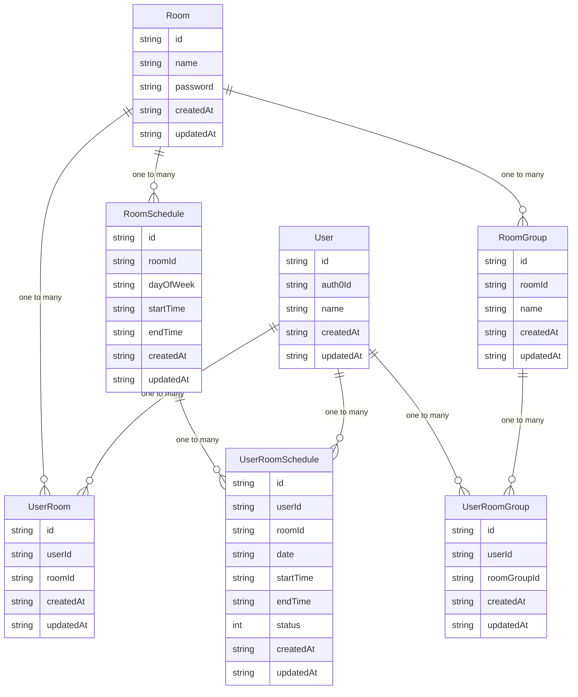

```mermaid
erDiagram
    User {
        string id
        string auth0Id
        string name
        string createdAt
        string updatedAt
    }
    Room {
        string id
        string name
        string password
        string createdAt
        string updatedAt
    }
    RoomSchedule {
        string id
        string roomId
        string dayOfWeek
        string startTime
        string endTime
        string createdAt
        string updatedAt
    }
    UserRoomSchedule {
        string id
        string userId
        string roomId
        string date
        string startTime
        string endTime
        int    status
        string createdAt
        string updatedAt
    }
    UserRoom {
        string id
        string userId
        string roomId
        string createdAt
        string updatedAt
    }
    RoomGroup {
        string id
        string roomId
        string name
        string createdAt
        string updatedAt
    }
    UserRoomGroup {
        string id
        string userId
        string roomGroupId
        string createdAt
        string updatedAt
    }

    User ||--o{ UserRoom : "one to many"
    Room ||--o{ RoomSchedule : "one to many"
    Room ||--o{ UserRoom : "one to many"
    Room ||--o{ RoomGroup : "one to many"
    RoomGroup ||--o{ UserRoomGroup : "one to many"
    User ||--o{ UserRoomGroup : "one to many"
    User ||--o{ UserRoomSchedule : "one to many"
    RoomSchedule ||--o{ UserRoomSchedule : "one to many"
```
